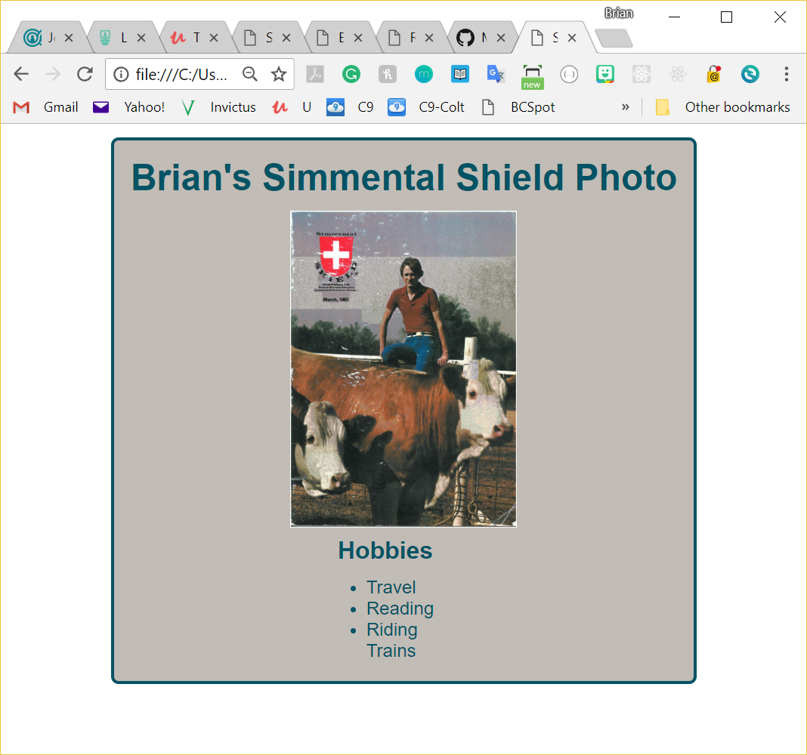

# React Multiple-component - One-file app with JSX and Javascript

OnePageReact.html
-----------------
This is a follow-on of my previous post on the OnePageReact review.  I have made a few changes:
  1. I removed ReactDOMFactories, and loaded in the Babel library so I can use JSX to create DOM elements
  2. I created a second component called HobbyList, and call it from the MyInfo component
  3. Inside HobbyList, I have an array of hobbies.  I think use the map() method to create the li items for the hobby list
  4. I added some more formatting to the page

Blog Post
---------
http://brianhafner.info/react-review-creating-a-single-file-single-component-page/

Screenshot for OnePageReact.html:
--------------------------

